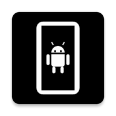

  

# Device

**Device** is a professional, ultra-lightweight Android system monitor and hardware diagnostic tool. Built with a "Zero-Dependency" philosophy, it leverages pure native Android APIs to provide deep insights into your device with virtually no overhead.

## 🚀 Key Features

### 🛠️ Hardware & System Diagnostic
*   **Device Identity**: Detailed manufacturer, model, board, and bootloader information.
*   **System Insight**: Android version, API level, kernel details, root status, and security provider versions.
*   **Processor Analytics**: Real-time per-core CPU frequencies, architecture, BogoMIPS, and instruction sets.
*   **GPU & AI**: OpenGL ES and Vulkan support details, along with NPU/TPU identification for modern chipsets.

### 📊 Performance Monitoring
*   **Memory (RAM)**: Real-time usage, Zram status, RAM type (LPDDR), and clock frequency.
*   **Storage Management**: Partition-level analysis (System, Data, SD Card) including hardware IDs and filesystem types.
*   **Battery Intelligence**: Health tracking, voltage, temperature, capacity (mAh), and real-time charging current (mA).
*   **Thermal Monitor**: Live system temperature tracking with periodic updates.

### 🔍 Advanced Specifications
*   **Display**: Resolution, density (DPI), refresh rate, HDR support, and wide color gamut diagnostics.
*   **Camera Suite**: Full lens specifications including Megapixels, focal length, aperture, ISO range, and physical lens counts.
*   **Wireless & Connectivity**: Status for Wi-Fi (2.4/5/6GHz), Bluetooth LE, NFC, GPS, and IR Emitter.
*   **Cellular Details**: Carrier information, SIM state, network type (4G/5G), and MCC/MNC data.
*   **Sensors**: Comprehensive list of all available hardware sensors with vendor details.

### 🧪 Utility Tools
*   **Screen Test**: Integrated diagnostic tool for dead pixels and color uniformity (Red, Green, Blue, White, Black).
*   **App Manager**: Quickly view and manage installed user and system applications.
*   **Adaptive UI**: Modern interface with full support for System-aware Dark and Light modes.

## 💎 Why "Zero Dependencies"?

Unlike most system tools that rely on heavy third-party libraries (like Jetpack, Dagger, or Retrofit), **Device** is built entirely on native Android Framework APIs.

*   **Minimal Footprint**: The APK size is kept at an absolute minimum.
*   **Maximized Performance**: No library overhead means faster launch times and lower memory usage.
*   **Security & Privacy**: No external code means reduced attack surface and no third-party data tracking.
*   **Stability**: No dependency version conflicts; runs reliably across all supported Android versions.

## 🛠️ Development

### Prerequisites
*   Android Studio Ladybug or newer.
*   Android SDK 35+ (Targeting SDK 37).
*   Minimum Android 5.0 (Lollipop).

### Build & Run
1. Clone the repository.
2. Open the project in Android Studio.
3. Sync Gradle (minimal sync time due to no external dependencies).
4. Build and deploy to your device.

## 📂 Project Structure

*   `MainActivity`: Core navigation and lifecycle management.
*   `HardwareActivity`: Unified logic for hardware category data retrieval.
*   `TemperatureActivity`: Background thermal monitoring and UI updates.
*   `ApplicationsActivity`: Package manager integration for app listing.
*   `ThemeManager`: Dynamic UI coloring and mode switching logic.

## 📜 License
**MIT License**. Keep it light, keep it fast. Stay in control.

---

**Developed with ❤️ by LiferLighdow**
